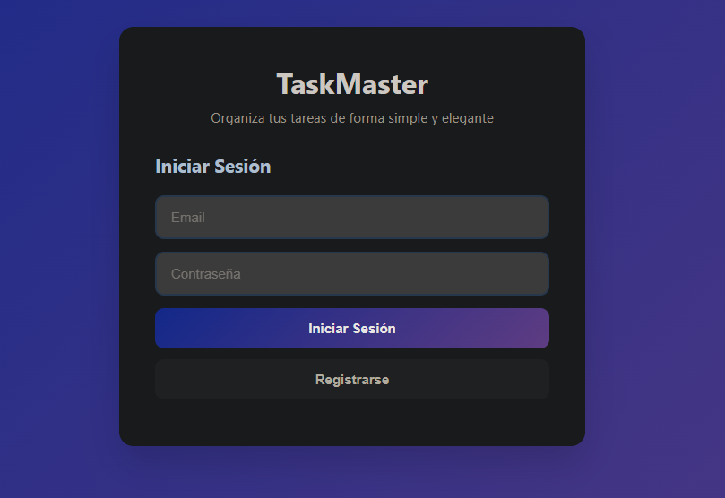
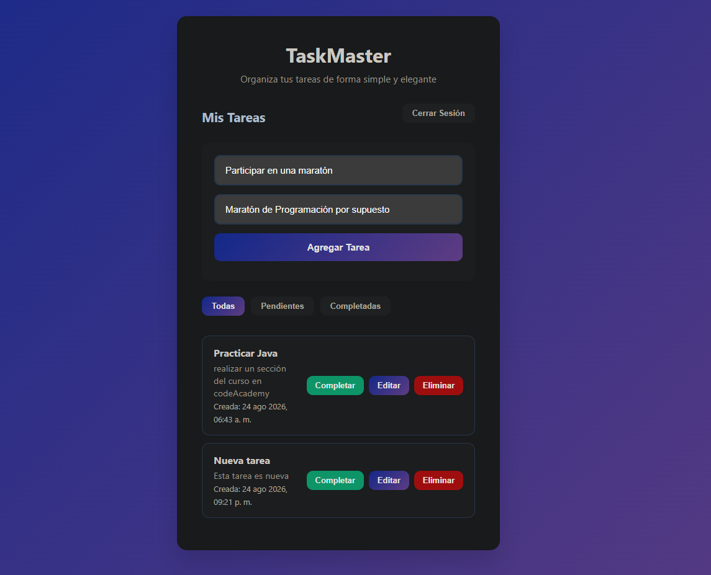

# TaskMaster

**Aplicación Full Stack de gestión de tareas** con autenticación de usuarios.

### Demo en vivo
**[https://taskmaster-fullstack.vercel.app](https://taskmaster-fullstack.vercel.app)**

---

## Características

- Registro e inicio de sesión con JWT
- Crear, editar, completar y eliminar tareas
- Filtros: Todas / Pendientes / Completadas
- Fecha y hora de creación de cada tarea
- Interfaz moderna, limpia y responsive
- Componentes reutilizables en React
- Backend y Frontend completamente desplegados

---

## Capturas de pantalla

### Pantalla de Login / Registro

### Lista de Tareas

---

## Tecnologías utilizadas

**Backend**
- FastAPI
- SQLAlchemy + SQLite
- JWT (python-jose + passlib)
- Desplegado en [Render](https://render.com)

**Frontend**
- React 18
- Vite
- Componentes funcionales + Hooks
- Desplegado en [Vercel](https://vercel.com)

---

## Estructura del proyecto

``bash
taskmaster-fullstack/
├── backend/                  # API REST con FastAPI
│   ├── app/
│   │   ├── core/             # Configuración y seguridad
│   │   ├── models/           # Modelos de base de datos
│   │   ├── routers/          # Endpoints
│   │   └── schemas/          # Validación con Pydantic
│   └── requirements.txt
├── frontend-react/           # Frontend con React + Vite
│   └── src/
│       └── components/       # Componentes reutilizables
└── README.md

## Cómo correrlo en local

### Backend
cd backend
python -m venv venv
# Windows
venv\Scripts\activate
pip install -r requirements.txt
uvicorn app.main:app --reload

### Frontend
cd frontend-react
npm install
npm run dev

### Autor

Hecho con fines de aprendizaje.
